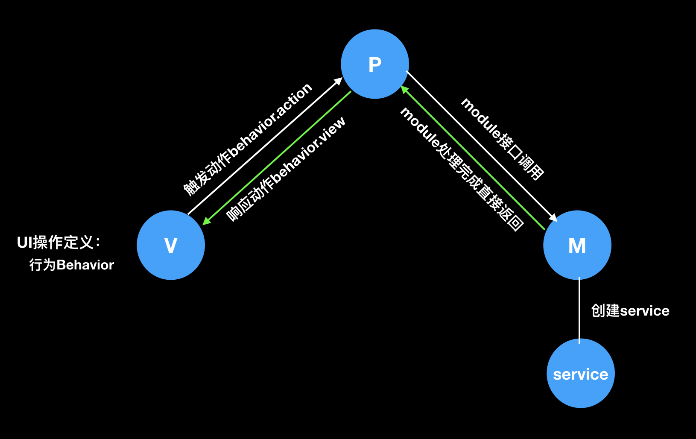

# MVP快速集成框架

[](https://www.jitpack.io/#JackZhous/MVPFrame)

集成的技术包含有retrofit、rxjava、okhttp、dagger和Android的Lifecycle，构成的MVP的快速开发框架

## 原理图



框架的目的是在与职责分离，模块间解耦，开发扩展

+ V 专注于界面UI的展示工作
+ P 业务逻辑、控制操作、数据提取
+ M 数据处理中心

## 使用方法

### 加入项目

有两种方法

1. 直接clone项目，项目frame module是框架module最好不要修改，App是示例demo，直接在demo中开发即可

2. gradle引入frame框架

Add it in your root build.gradle at the end of repositories:

```
allprojects {
		repositories {
			...
			maven { url 'https://www.jitpack.io' }
		}
	}
```

 Add the dependency
```
dependencies {
	        implementation 'com.github.JackZhous:MVPFrame:v1.2'
	}
```

### 代码开发

#### 定义P层行为方法

P层方法主要包括在UI中的网络调用以及回调接口，该层完成主要的业务控制操作以及一些数据传递

```java
public interface LoginBehavior {

    //动作发起
    interface LoginAction extends IPresenter {

        /**
         * 登录方法
         * @param username 用户名
         * @param passwd 密码
         */
        void login(String username, String passwd);
    }

    //动作响应
    interface LoginView extends IView {
        void loginSuccess(String msg);
    }

}
```

#### 定义M层方法

M层方法主要是底层方法，该层可以作为数据处理的主要层

```java
public interface IUserModule extends IModule {

    Observable<User> loginUser(String name, String passwd);
}
```

#### 定义网络底层服务

service对应网络访问接口

```java
public interface UserService {
    @POST("xyyc/app/")
    Observable<LoginResponse> login(@Body LoginRequest request);
}
```

#### 实现上述接口

每层都已经实现了其base基类，开发时只需要集成对应层的基类，继承时注意泛型；以下是简短代码

##### Activity

```java
public class LoginActivity extends BaseActivity<LoginBehavior.LoginAction> 
        implements LoginBehavior.LoginView {}
```

##### Presenter

```java
public class LoginPresenter extends BasePresenter<IUserModule, LoginBehavior.LoginView>
                                                    implements  LoginBehavior.LoginAction{}
```

#### Module

```java
public class UserModule  extends BaseModule implements IUserModule {}
```

__每层每个类具体的逻辑如何请参考项目demo__

#### 配置dagger进行依赖注入

主要创建Activity的对应的Component和module，根据自己的需求进行provide和inject；需要注意的是module、Presenter的生命周期是和Activity绑定在一起的，需要为他们都标记ActivityScope注解


#### Application

继承框架的MyApp Application，重写netconfig方法，配置服务器地址及连接属性的

