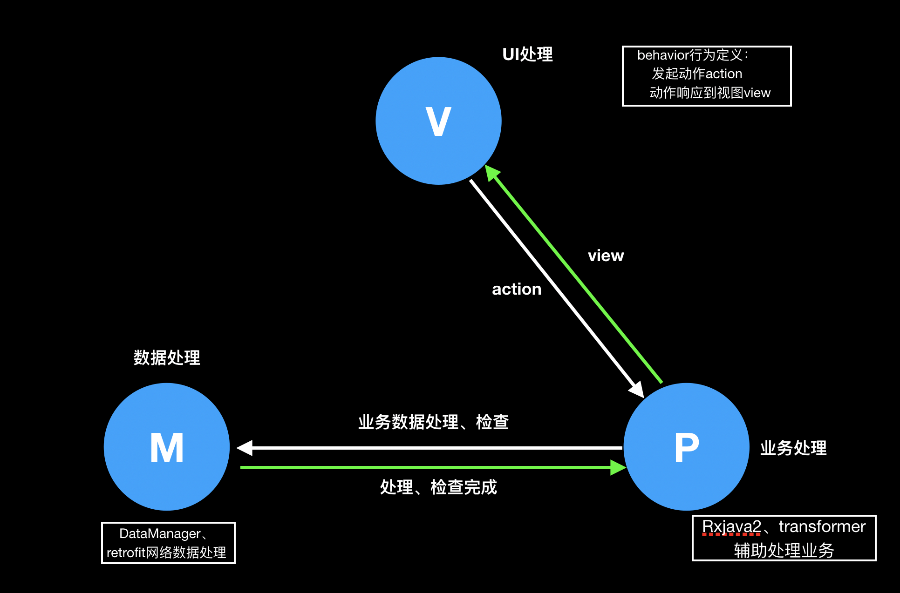

# MVP快速集成框架

## 原理图




## Java类及包路径解释

### com.jz.appframe.behavior

behavior路径下定义每个视图(Activity)的请求行为和响应行为，内部对应到每一个方法

### com.jz.appframe.data

app数据处理package，其中DataManager是网络接口的再次封装，local是本地数据集合，remote是远端响应的数据集合，net是网络底层封装

### com.jz.presen

presenter集合，presenter使用专门的工程类PresenterFactory统一创建，绑定到每个Activity

### ui

Activity集合

## 泛型与接口

框架使用了很多泛型，主要是用于Presenter和Activity的快速绑定和减少暴露方法，大量接口用于PV层解耦

## 使用步骤

1. 定义行为

```java
public interface LoginBehavior {

    //动作发起
    interface LoginAction extends PresenterView<LoginView> {
        void login(String username, String passwd);
    }

    //动作响应
    interface LoginView extends CommView{
        void loginSuccess(String msg);
    }

}
```

2. 定义View层

```java
public class LoginActivity extends BaseActivity<LoginBehavior.LoginAction> implements LoginBehavior.LoginView {

    @Override
    protected void onCreate(@Nullable Bundle savedInstanceState) {
        super.onCreate(savedInstanceState);
        ButterKnife.bind(this);
        showMessage(getStringValueFromLast("data", "null"));
    }

    @OnClick({R.id.btn_login})
    public void onClick(View view){
        int id = view.getId();

        switch (id){
            case R.id.btn_login:
                getPresenter().login("1212", "password");
        }
    }

    @Override
    public void loginSuccess(String msg) {
        showMessage("login success" + msg);
    }

    //提供Activity的布局
    @Override
    protected int layout() {
        return R.layout.activity_login;
    }

    //提供presenter
    @Override
    protected LoginBehavior.LoginAction provideP() {
        return getMyApp().getPresenterFactory().createLoginPresenter();
    }
    
    //pv绑定
    @Override
    protected void onAttach() {
        getPresenter().attach(this);
    }
    //pv解绑
    @Override
    protected void onDetach() {
        getPresenter().detach();
    }

}
```

其中返修loginAction是标明presenter的类型，必须重写BaseActivity的四个方法，解释如注释；另外 __为了方便Activity集中管理，使用ActFactory类集中生产new__

3. 定义Presenter

```java
public class LoginPresenter extends BasePresenter<LoginBehavior.LoginView>
                                                    implements  LoginBehavior.LoginAction{

    public LoginPresenter(DataManager dataManager) {
        super(dataManager);
    }


    @Override
    public void login(String username, String passwd) {
        Disposable disposable = dataManager.login(username, passwd)
                .subscribeOn(Schedulers.io())
                .compose(RxTransformHelper.<LoginResponse>ioMainProgress(getView(), "加载中", false))
                .observeOn(AndroidSchedulers.mainThread())
                .compose(RxTransformHelper.<LoginResponse>ioMainException(getView()))
                .subscribe(new Consumer<LoginResponse>() {
                    @Override
                    public void accept(LoginResponse loginResponse) throws Exception {
                        getView().loginSuccess(loginResponse.getMessage());
                    }
                });

        disposableRaiser.add(disposable);
    }
}
```

RxTransformHelper主要是帮忙处理状态显示、异常处理；__Presenter也用工厂统一生产PresenterFactory__

4. 底层网络连接、其他一些小的工具类，详细键代码
